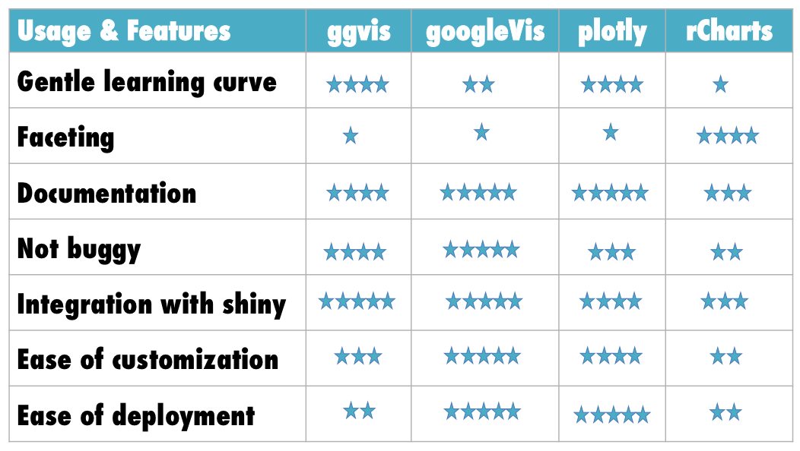
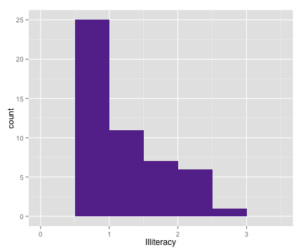
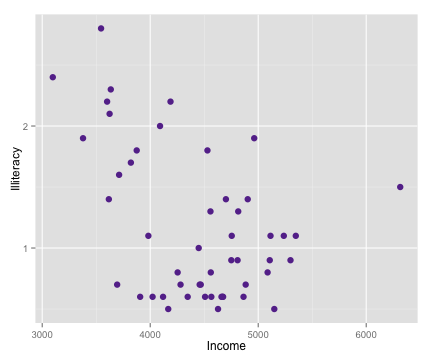

## Data Viz Versus Graphics

<p style="align:left;color:#669999;background-color:#e0eaea;padding:2%;"><i>Data visualizations</i> are interactive graphics designed for the Web.</p>


* Unlike traditional static graphical displays, data visualizations are:
  - Built for the Web
  - Interactive
  - Dynamic

---

## Why Data Viz in R?

* Majority of R tools for data viz are basically a set of functions to write javascript (js) output

* Chances are, if you are looking at an interactive graphic on the Web, it's written in js using a library like d3

* But...<u>what if you don't know js?</u> or <u>you have to do a lot of analysis</u> to produce the output for your chart?

---

## Popular R Tools for Data Viz

* ggvis

* googleVis

* plotly

* rCharts

* htmlwidgets

---

## Overview



---

## Demonstration

* It is easiest to understand the differences between the visualization tools by seeing them in action

* In what follows, I'll use R's built-in dataset <code>state.x77</code> to conduct several charting exercises


```r
data(state)
state.x77 <- as.data.frame(state.x77)
str(state.x77)
```

```
## 'data.frame':	50 obs. of  8 variables:
##  $ Population: num  3615 365 2212 2110 21198 ...
##  $ Income    : num  3624 6315 4530 3378 5114 ...
##  $ Illiteracy: num  2.1 1.5 1.8 1.9 1.1 0.7 1.1 0.9 1.3 2 ...
##  $ Life Exp  : num  69 69.3 70.5 70.7 71.7 ...
##  $ Murder    : num  15.1 11.3 7.8 10.1 10.3 6.8 3.1 6.2 10.7 13.9 ...
##  $ HS Grad   : num  41.3 66.7 58.1 39.9 62.6 63.9 56 54.6 52.6 40.6 ...
##  $ Frost     : num  20 152 15 65 20 166 139 103 11 60 ...
##  $ Area      : num  50708 566432 113417 51945 156361 ...
```

---

## Task 1. Distribution of State Illiteracy

* Make the following static histogram interactive


```r
# Static plot
library(ggplot2)
ggplot(state.x77, aes(x = Illiteracy)) +
  geom_histogram(binwidth = 0.5, fill = "#663399")
```

 

---

## Demo - Histogram

[link]

---

## Task 2. State Illiteracy Versus Income 

* Make the following scatterplot interactive


```r
# Static plot
ggplot(state.x77, aes(y = Illiteracy, x = Income)) +
  geom_point(size = 3, col = "#663399")   
```

 

---

## Task 3. Add State as a Tooltip

---

## Task 4. Add Trendlines


---


## Take 4. Make an Interactive Heatmap


---

## Resources 

In addition to package documentation...

* [ggvis -> http://ggvis.rstudio.com](http://ggvis.rstudio.com)

* [googleVis -> https://developers.google.com/chart/](https://developers.google.com/chart/)

* [plotly -> https://plot.ly/r/reference/](https://plot.ly/r/reference/)

* [rCharts -> http://rcharts.io/](http://rcharts.io/)

* [htmlwidgets -> http://www.htmlwidgets.org/](http://www.htmlwidgets.org/)


